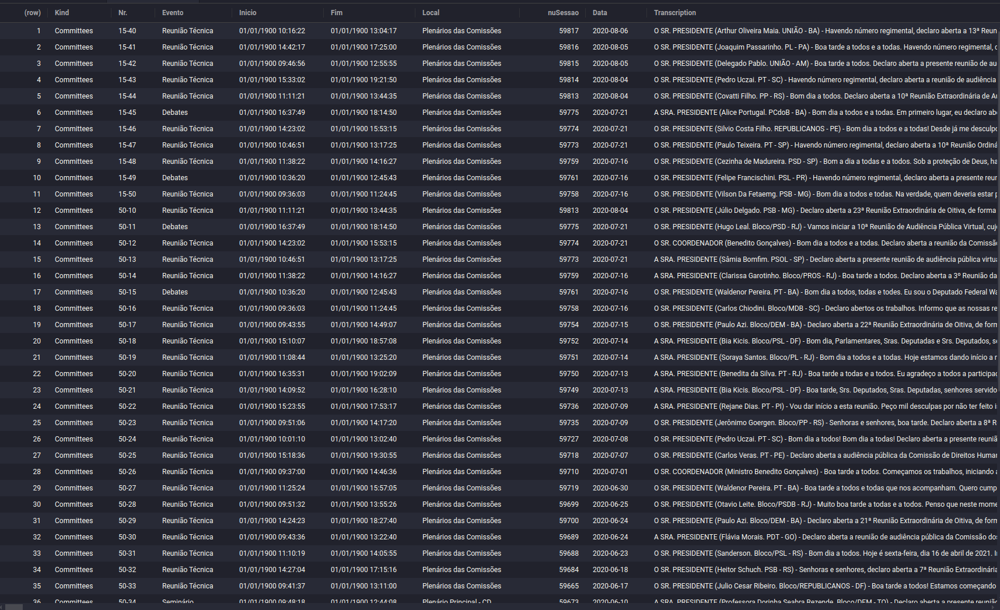

# BrPoliCorpus: Brazilian Political Corpus

by [Rodrigo Esteves de Lima-Lopes][def] (Universidade Estadual de Campinas)

## Introduction

This is the version 1.0 of the package **BrPoliCorpus** (Brazilian Political Corpus). It is intended to be a free repository of open data regarding official documents of Brazilian Politics. This is part of my project of creating a comprehensive and freely available corpus of Brazilian Portuguese political 

## Data

For the current time, the following datasets are available:

- Inaugural Speeches: A set of Brazilian President's Inaugural Speeches.
  - Updated until 01/01/2023
- Parliamentary Floor: A set of all parliamentary discourses available from October/2000 until September 2023.
  - Updated until 01/07/2024
- Governmental Programmes: A set of candidates programmes for the Brazilian Elections. From 2014 on.
  - Updated until 01/07/2024
- CPI: Brazilian Parliamentary Inquire Commission.
  - Only one CPI available
  - Updated until 01/07/2024

### Corpus size

| Doc                          | Types      | Tokens      |
|------------------------------|------------|-------------|
| CPI                          | 2615392    | 4563382     |
| Parliamentary Committees     | 7985000    | 108251624   |
| Floor Parliamentary speeches | 3423405    | 322893136   |
| Gov. Programmes              | 688342     | 5849807     |
| Inaugural Speeches           | 31959      | 86206       |
| Total                        | 14.744.098 | 441.644.155 |


## Availability

This data is available in both CSV for free download and as a set of R commands for integrating data into R environment.

- Availability on CSV data might be [found here](doc/CSV_Download.md). 
- The R package has a set of functions responsible for downloading specific pieces of data. Please, see the [vignette](vignettes/) for a more detailed discussion.

### Organisation of each CSV module

Each module is distributed as a CSV file containing the text and some metadata regarding the text.The CSV files can be downloaded individually (see how to do it [here](doc/CSV_Download.md)).

For those who are downloading the CSV file, keep in mind that a column contains the text, but others are metadata.  See an example:




For use in ordinary Corpus Linguistics software, like WordSmith Tools and Anticonc, these columns have to be extracted and saved as single text files. If you have interest in doing so, [please let me know][def], so I can provide a single file structure to you. 

### R Package and commands

Once you have installed the package (see instructions bellow) run:

```
download_index() 
View(IndexFunctions)
```
The first command will download a general index of the data available and the second will open the set of commands for data downloading. An example would be:

```
Committees006 <- download_Committees_006_data()
```
## R package

### Installation

In R, this package might be installed using `devtools`

    library(devtools)
    install_github("rll307/BrPoliCorpus")

## Contribution

The following researchers have contributed to this corpus:

- [Prof. Dr. Rodrigo Esteves de Lima-Lopes][def] (UNICAMP)
    - Coding, data scraping, corpus conceptualisation, package building
- [Dr. Jörn Stegmeier][def2] (TU-Darmstadt)
    - Coding, data scraping, data scraping infrastructure
- [Ni Yan][def3] (TU-Darmstadt)
   - Coding, data scraping
- [Dariia Shamgunova][def4]  (TU-Darmstadt)
   - Coding, data scraping
- [Rodrigo Dornelles][def5] (Independent Researcher)
   - Coding, data scraping
## Acknowledgments

I would like to acknowledge CAPES and Alexander Humboldt Foundation for financing this version of this Corpus. To all the team of TU-Darmstadt who made this project possible.


## How to cite:

    @software{BrPoliCorpus,
      author = {Rodrigo Esteves {de Lima-Lopes}},
      title = {BrPoliCorpus: Brazilian Political Corpus},
      url = {https://github.com/rll307/BrPoliCorpus.git},
      version = {1.0},
      date = {2024-7-01},
    }

[def]: mailto:rll307@unicamp.br
[def2]: mailto:stegmeier@linglit.tu-darmstadt.de
[def3]: mailto:ni.yan@tu-darmstadt.de
[def4]: mailto:dariia.shamgunova@stud.tu-darmstadt.de
[def5]: https://www.linkedin.com/in/rfdornelles/ 